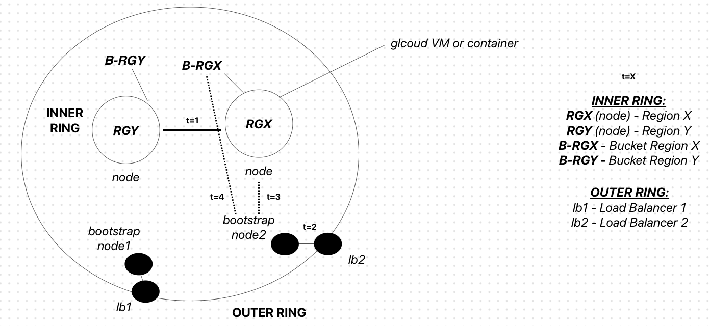
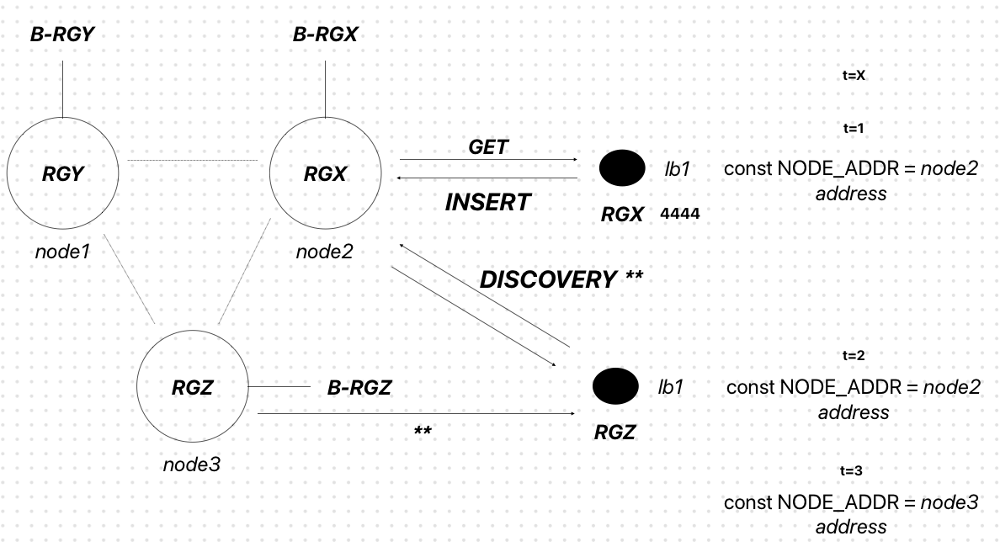

# Lightweight UDP CDN (CC4092)
Lightweight Content Delivery Network (CDN) based on UDP and deployed on gcloud (using gcloud VM instances). gcloud firewall rules need to be set appropriately to allow content distribution. 

<pre>
lb              --> Load Balancer Node (Clients)
node            --> Internal Nodes
orchestrator.py --> Gcloud wrapper script used to provision the CDN

Notes:
    - Internal Nodes have two possible types: 0 --> orchestrator | 1 --> internal.
    - Orchestrator Nodes are the initial static nodes responsible for descovering other nodes in the inner ring.
    - Each Client (Load Balancer Node) has a exposed Flask app where content can be pushed + pulled.

Steps:
    - Install gcloud CLI & authenticate.
    - Set credentials in node.
    - Use orchestrator to start the internal ring and client apps.
</pre>

### Overview:

### Discovery:
